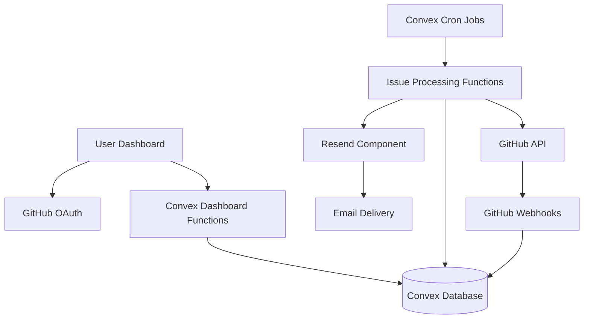

# Design Document

## Overview

StaleBot is a serverless application built on Convex that monitors GitHub repositories for stale issues and sends email notifications to maintainers. The system follows a scheduled processing pattern where Convex cron jobs periodically fetch repository data via the GitHub API, apply user-defined rules to identify stale issues, and send consolidated email notifications using the Resend component.

The architecture emphasizes reliability, scalability, and user experience through durable execution, proper error handling, and efficient batching of operations.

## Architecture

### High-Level Architecture



### Technology Stack

- **Backend**: Convex (serverless functions, database, cron jobs)
- **Frontend**: React/Next.js (hosted on Convex)
- **Authentication**: GitHub OAuth via Convex Auth
- **Email Service**: Resend component for Convex
- **External APIs**: GitHub REST API v4
- **Database**: Convex built-in database

### Data Flow

1. **Setup Phase**: User authenticates, selects repositories, configures rules
2. **Monitoring Phase**: Cron jobs fetch issues, apply rules, identify stale issues
3. **Notification Phase**: Generate and send email notifications via Resend
4. **Feedback Phase**: Track delivery status, update dashboard

## Components and Interfaces

### Core Data Models

#### User Profile
```typescript
interface UserProfile {
  _id: Id<"users">;
  githubId: string;
  email: string;
  accessToken: string; // encrypted
  refreshToken: string; // encrypted
  repositories: Id<"repositories">[];
  notificationPreferences: NotificationPreferences;
  createdAt: number;
  lastActive: number;
}
```

#### Repository Configuration
```typescript
interface Repository {
  _id: Id<"repositories">;
  userId: Id<"users">;
  githubId: number;
  name: string;
  fullName: string; // owner/repo
  isActive: boolean;
  rules: Id<"rules">[];
  lastChecked: number;
  lastIssueCount: number;
  createdAt: number;
}
```

#### Stale Detection Rules
```typescript
interface StaleRule {
  _id: Id<"rules">;
  userId: Id<"users">;
  repositoryId: Id<"repositories">;
  name: string;
  inactivityDays: number;
  labels: string[]; // empty array means all labels
  issueStates: ("open" | "closed")[];
  assigneeCondition: "any" | "assigned" | "unassigned" | string[]; // specific users
  isActive: boolean;
  createdAt: number;
  updatedAt: number;
}
```

#### Issue Tracking
```typescript
interface TrackedIssue {
  _id: Id<"issues">;
  repositoryId: Id<"repositories">;
  githubIssueId: number;
  title: string;
  url: string;
  state: "open" | "closed";
  labels: string[];
  assignee: string | null;
  lastActivity: number;
  isStale: boolean;
  lastNotified: number | null;
  createdAt: number;
  updatedAt: number;
}
```

#### Notification Records
```typescript
interface NotificationRecord {
  _id: Id<"notifications">;
  userId: Id<"users">;
  repositoryId: Id<"repositories">;
  issueIds: Id<"issues">[];
  emailId: string; // from Resend
  status: "pending" | "sent" | "delivered" | "bounced" | "failed";
  sentAt: number;
  deliveredAt: number | null;
}
```

### API Functions

#### Authentication Functions
- `auth.signInWithGitHub()`: Handle GitHub OAuth flow
- `auth.signOut()`: Clear user session
- `auth.getCurrentUser()`: Get authenticated user profile

#### Repository Management
- `repositories.listUserRepos()`: Fetch user's GitHub repositories
- `repositories.addToMonitoring(repoIds)`: Add repositories to monitoring
- `repositories.removeFromMonitoring(repoIds)`: Remove repositories
- `repositories.updateRepositorySettings(repoId, settings)`: Update repo config

#### Rule Management
- `rules.createRule(ruleData)`: Create new stale detection rule
- `rules.updateRule(ruleId, updates)`: Update existing rule
- `rules.deleteRule(ruleId)`: Delete rule
- `rules.listUserRules(userId)`: Get all rules for user

#### Issue Processing (Internal Functions)
- `processor.checkAllRepositories()`: Main cron job function
- `processor.checkRepository(repoId)`: Process single repository
- `processor.fetchIssuesFromGitHub(repoId)`: Get issues via GitHub API
- `processor.applyStaleRules(issues, rules)`: Identify stale issues
- `processor.sendNotifications(staleIssues)`: Trigger email notifications

#### Dashboard Functions
- `dashboard.getUserDashboard(userId)`: Get dashboard data
- `dashboard.getNotificationHistory(userId)`: Get recent notifications
- `dashboard.manualRefresh(repoId)`: Trigger manual repository check

### External Integrations

#### GitHub API Integration
```typescript
class GitHubService {
  async fetchRepositoryIssues(
    accessToken: string,
    owner: string,
    repo: string,
    since?: Date
  ): Promise<GitHubIssue[]>;
  
  async validateRepositoryAccess(
    accessToken: string,
    repoId: number
  ): Promise<boolean>;
  
  async refreshAccessToken(refreshToken: string): Promise<TokenResponse>;
}
```

#### Resend Email Integration
```typescript
// Using the Convex Resend component
export const resend = new Resend(components.resend, {
  testMode: false,
  onEmailEvent: internal.notifications.handleEmailEvent,
});

export const sendStaleIssueNotification = internalMutation({
  handler: async (ctx, args: {
    userId: Id<"users">;
    repositoryName: string;
    staleIssues: TrackedIssue[];
  }) => {
    const user = await ctx.db.get(args.userId);
    const emailHtml = generateStaleIssueEmail(args.repositoryName, args.staleIssues);
    
    const emailId = await resend.sendEmail(ctx, {
      from: "StaleBot <noreply@stalebot.dev>",
      to: user.email,
      subject: `Stale Issues Found in ${args.repositoryName}`,
      html: emailHtml,
    });
    
    return emailId;
  },
});
```

## Data Models

### Database Schema Design

The Convex database will use the following collections:

1. **users**: Store user profiles and authentication data
2. **repositories**: Track monitored repositories and their configurations
3. **rules**: Store stale detection rules with flexible criteria
4. **issues**: Cache issue data and track staleness status
5. **notifications**: Record email notifications and delivery status

### Relationships

- Users have many Repositories (1:N)
- Repositories have many Rules (1:N)
- Repositories have many Issues (1:N)
- Users have many Notifications (1:N)
- Notifications reference multiple Issues (N:M)

### Indexing Strategy

```typescript
// Key indexes for performance
export default defineSchema({
  users: defineTable({
    githubId: v.string(),
    email: v.string(),
    // ... other fields
  }).index("by_github_id", ["githubId"]),
  
  repositories: defineTable({
    userId: v.id("users"),
    githubId: v.number(),
    isActive: v.boolean(),
    // ... other fields
  })
    .index("by_user", ["userId"])
    .index("by_github_id", ["githubId"])
    .index("by_active", ["isActive"]),
  
  issues: defineTable({
    repositoryId: v.id("repositories"),
    githubIssueId: v.number(),
    isStale: v.boolean(),
    lastActivity: v.number(),
    // ... other fields
  })
    .index("by_repository", ["repositoryId"])
    .index("by_stale_status", ["repositoryId", "isStale"])
    .index("by_last_activity", ["lastActivity"]),
});
```

## Error Handling

### GitHub API Error Handling

1. **Rate Limiting**: Implement exponential backoff with jitter
2. **Authentication Errors**: Refresh tokens automatically, prompt re-auth if needed
3. **Repository Access**: Handle permission changes gracefully
4. **Network Errors**: Retry with circuit breaker pattern

```typescript
class GitHubErrorHandler {
  async withRetry<T>(operation: () => Promise<T>, maxRetries = 3): Promise<T> {
    for (let attempt = 1; attempt <= maxRetries; attempt++) {
      try {
        return await operation();
      } catch (error) {
        if (this.isRateLimitError(error)) {
          await this.handleRateLimit(error);
        } else if (this.isAuthError(error) && attempt === maxRetries) {
          throw new AuthenticationError("GitHub token expired");
        } else if (attempt === maxRetries) {
          throw error;
        }
        
        await this.delay(Math.pow(2, attempt) * 1000);
      }
    }
  }
}
```

### Email Delivery Error Handling

The Resend component handles most email delivery concerns:
- Automatic retries with exponential backoff
- Queue management for high volume
- Bounce and complaint handling via webhooks
- Idempotency to prevent duplicate sends

### Database Error Handling

1. **Optimistic Concurrency**: Handle version conflicts in updates
2. **Transaction Rollback**: Use Convex transactions for multi-table operations
3. **Data Validation**: Validate all inputs before database operations

## Testing Strategy

### Unit Testing

1. **Rule Engine Testing**: Test stale detection logic with various scenarios
2. **GitHub API Integration**: Mock API responses for different conditions
3. **Email Template Generation**: Test email formatting and content
4. **Date/Time Logic**: Test inactivity calculations and timezone handling

### Integration Testing

1. **End-to-End Workflows**: Test complete user journeys
2. **External API Integration**: Test with GitHub API sandbox
3. **Email Delivery**: Test with Resend test mode
4. **Cron Job Execution**: Test scheduled processing logic

### Performance Testing

1. **Large Repository Handling**: Test with repos having 1000+ issues
2. **Batch Processing**: Test processing multiple repositories
3. **Email Volume**: Test sending notifications to many users
4. **Database Query Performance**: Test with realistic data volumes

### Error Scenario Testing

1. **GitHub API Failures**: Test various error conditions
2. **Email Delivery Failures**: Test bounce and failure handling
3. **Network Interruptions**: Test resilience to connectivity issues
4. **Invalid User Input**: Test validation and error messages

### Test Data Management

```typescript
// Test utilities for creating realistic test data
export const TestDataFactory = {
  createUser: (overrides?: Partial<UserProfile>) => ({
    githubId: "test-user-123",
    email: "test@example.com",
    accessToken: "encrypted-token",
    repositories: [],
    notificationPreferences: defaultPreferences,
    ...overrides,
  }),
  
  createRepository: (overrides?: Partial<Repository>) => ({
    githubId: 12345,
    name: "test-repo",
    fullName: "testuser/test-repo",
    isActive: true,
    rules: [],
    lastChecked: Date.now(),
    ...overrides,
  }),
  
  createStaleIssue: (daysStale: number) => ({
    githubIssueId: Math.floor(Math.random() * 10000),
    title: "Test Issue",
    state: "open" as const,
    labels: ["bug"],
    lastActivity: Date.now() - (daysStale * 24 * 60 * 60 * 1000),
    isStale: true,
  }),
};
```

This design provides a robust foundation for StaleBot that handles the complexity of GitHub API integration, reliable email delivery, and user management while maintaining good performance and error resilience.